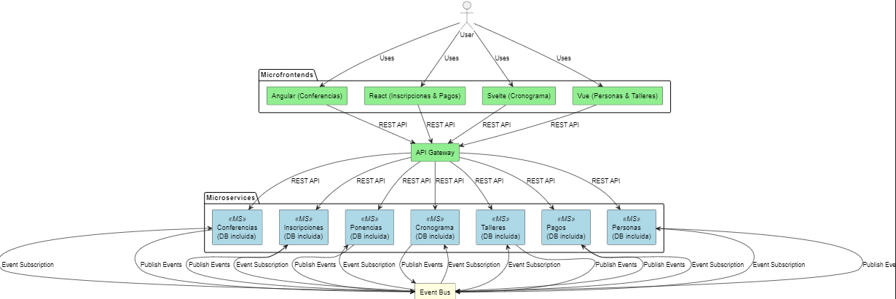

# Proyecto de Arquitectura de Microservicios con Microfrontends

Este proyecto implementa una arquitectura de microservicios con microfrontends, comunicándose mediante un **API Gateway** y un **Event Bus** para manejar eventos asíncronos. Los microservicios están desacoplados, cada uno tiene su propia base de datos y son escalables de forma independiente. Los microfrontends están desarrollados en distintos frameworks (Angular, React, Svelte, Vue) para diferentes áreas de funcionalidad.

## Requisitos del Sistema (Alto Nivel)

### Descripción General

- **Objetivo**: Crear un sistema modular y escalable que administre eventos como conferencias, talleres, pagos, inscripciones y gestión de perfiles de usuarios.
- **Arquitectura**: Arquitectura basada en microservicios con microfrontends, soportada por un **API Gateway** para manejo de solicitudes síncronas y un **Event Bus** para comunicación asíncrona entre microservicios.
- **Frontend**: Se utiliza un enfoque de microfrontends para permitir el uso de múltiples frameworks de frontend y facilitar la modularidad de la aplicación.
- **Backend**: Cada microservicio se encarga de un dominio específico, tiene su propia base de datos y se comunica de manera independiente con otros servicios a través del Event Bus o el API Gateway.

---

## Requisitos Funcionales

### 1. Gestión de Conferencias
- **Funcionalidad**: Los administradores pueden crear, editar, activar/desactivar y listar conferencias.
- **Microfrontend**: Angular
- **Microservicio**: `Conferencias`
- **Base de datos**: Almacena detalles de las conferencias.
- **Endpoints**:
  - Crear, listar, editar y desactivar conferencias.

### 2. Gestión de Inscripciones
- **Funcionalidad**: Permitir a los usuarios registrarse y anular inscripciones en conferencias.
- **Microfrontend**: React
- **Microservicio**: `Inscripciones`
- **Base de datos**: Almacena detalles de las inscripciones.
- **Endpoints**:
  - Registrar, anular y listar inscripciones.

### 3. Gestión de Ponencias
- **Funcionalidad**: Administración de ponencias relacionadas con cada conferencia.
- **Microfrontend**: Angular
- **Microservicio**: `Ponencias`
- **Base de datos**: Almacena detalles de cada ponencia.
- **Endpoints**:
  - Crear, listar y editar ponencias.

### 4. Gestión del Cronograma
- **Funcionalidad**: Crear y editar cronogramas de conferencias.
- **Microfrontend**: Svelte
- **Microservicio**: `Cronograma`
- **Base de datos**: Almacena datos de cronogramas.
- **Endpoints**:
  - Crear, listar y editar cronogramas.

### 5. Gestión de Talleres
- **Funcionalidad**: Administración de talleres dentro de cada conferencia.
- **Microfrontend**: Vue
- **Microservicio**: `Talleres`
- **Base de datos**: Almacena detalles de los talleres.
- **Endpoints**:
  - Crear, listar y editar talleres.

### 6. Gestión de Pagos
- **Funcionalidad**: Procesar pagos de inscripciones a conferencias.
- **Microfrontend**: React
- **Microservicio**: `Pagos`
- **Base de datos**: Almacena detalles de los pagos.
- **Endpoints**:
  - Registrar pago, cancelar pago, verificar estado de pago.

### 7. Gestión de Perfiles de Usuarios
- **Funcionalidad**: Permitir a los usuarios gestionar sus datos personales.
- **Microfrontend**: Vue
- **Microservicio**: `Personas`
- **Base de datos**: Almacena datos de usuarios.
- **Endpoints**:
  - Crear, actualizar y listar datos personales.

---

## Requisitos No Funcionales

### 1. Escalabilidad
- Cada microservicio y microfrontend debe ser escalable de forma independiente para manejar aumentos en la carga de usuarios o de solicitudes.

### 2. Desempeño
- El sistema debe responder a las solicitudes en menos de 2 segundos bajo carga normal.
- Soportar un alto volumen de solicitudes concurrentes, especialmente en la gestión de inscripciones y pagos.

### 3. Disponibilidad
- La arquitectura debe garantizar alta disponibilidad, minimizando los puntos de fallo único.
- Cada microservicio debe tener una tolerancia de fallo del 99.9%.

### 4. Seguridad
- **Autenticación y Autorización**: El API Gateway debe implementar autenticación y autorización para garantizar el acceso seguro a los microservicios.
- **Protección de Datos**: Los datos personales y de pagos deben estar encriptados y manejarse conforme a normativas de privacidad de datos (como GDPR).

### 5. Mantenibilidad
- Código modular y separado por servicio para facilitar actualizaciones y mantenimiento sin afectar a otros servicios.
- Uso de prácticas de desarrollo continuo (CI/CD) para implementar cambios de manera eficiente y segura.

### 6. Trazabilidad y Monitoreo
- Implementación de monitoreo y logging para rastrear el funcionamiento de cada microservicio y la comunicación en el Event Bus.
- Integración de una solución de monitoreo centralizada para alertas y trazabilidad de eventos.

### 7. Tolerancia a Fallos
- Si un microservicio falla, el sistema debe seguir funcionando, limitando el impacto al servicio específico.
- Implementación de reintentos automáticos para la comunicación entre microservicios cuando se detecten errores temporales.

### 8. Integridad y Consistencia de Datos
- La arquitectura debe garantizar que los datos sean consistentes en todos los microservicios.
- Implementación de patrones como **Sagas** para transacciones distribuidas en procesos críticos (e.g., inscripciones y pagos).

---

## Tecnologías Utilizadas

- **Frontend**: Angular, React, Svelte, Vue (Microfrontends)
- **Backend**: Microservicios en Node.js o Spring Boot
- **API Gateway**: NGINX o Kong
- **Event Bus**: RabbitMQ o Apache Kafka para la comunicación asíncrona
- **Bases de Datos**: MySQL o MongoDB (una instancia por microservicio)
- **Infraestructura**: Docker y Kubernetes para la orquestación de contenedores y escalabilidad

---

Este archivo proporciona una visión completa de los requisitos del sistema y puede ampliarse según las necesidades del proyecto.
